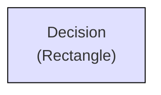
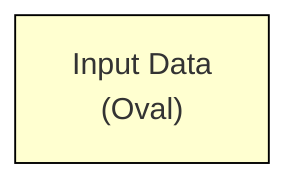
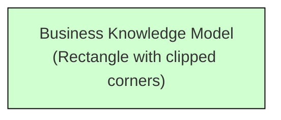
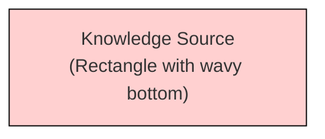
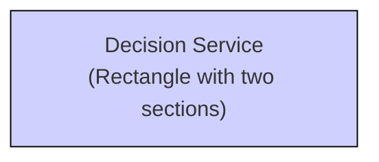
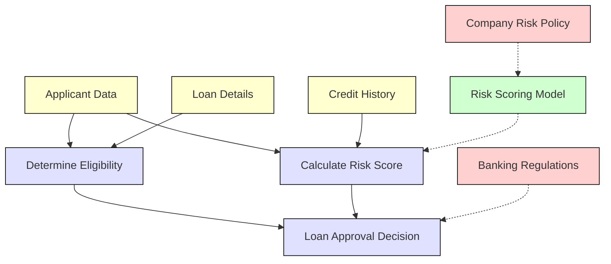

## Introduction to DMN Components

DMN (DMN) provides a standard approach to modeling and implementing business decisions. This section explores the key components that make up the DMN standard and how they work together in the Aletyx Enterprise Build of Kogito and Drools 10.1.0-aletyx.

DMN consists of two complementary aspects:

1. **Decision Requirements Diagram (DRD)**: The visual representation of decision components and their relationships
2. **Decision Logic**: The detailed implementation of how decisions are made

## Decision Requirements Diagram (DRD) Components

A Decision Requirements Diagram provides a visual representation of a decision model's structure. It shows how different decisions relate to each other and what information they require.

### Primary Components

#### Decision Node



A decision node represents a point where one or more inputs determine an output based on defined decision logic. In the DRD, decisions are shown as rectangles.

**Key characteristics:**

- Requires one or more inputs (from input data nodes or other decisions)
- Contains decision logic (decision table, literal expression, etc.)
- Produces a specific output value when evaluated

**Example use cases:**

- "Determine Customer Discount"
- "Calculate Insurance Premium"
- "Evaluate Credit Risk"

#### Input Data Node



Input data nodes represent information used in decisions. These are shown as ovals in the DRD.

**Key characteristics:**

- Represents external information provided to the decision model
- Does not contain decision logic
- Often corresponds to business entities or concepts

**Example use cases:**

- "Customer Information"
- "Policy Details"
- "Transaction Data"

#### Business Knowledge Model



Business knowledge models encapsulate reusable decision logic. They are represented as rectangles with clipped corners.

**Key characteristics:**

- Contains reusable function logic
- Can be invoked by decisions or other business knowledge models
- Promotes component reuse and modular design

**Example use cases:**

- "Calculate Monthly Payment"
- "Determine Risk Score"
- "Validate Address"

#### Knowledge Source



Knowledge sources identify authorities for decisions or business knowledge models. These appear as rectangles with wavy bottoms.

**Key characteristics:**

- Represents the source of decision logic (not executable)
- Can be regulatory documents, policies, or subject matter experts
- Provides traceability for decision logic

**Example use cases:**

- "Regulatory Guidelines"
- "Company Policy"
- "Actuarial Tables"

#### Decision Service



Decision services encapsulate a set of decisions for invocation as a unit. They are shown as rectangles divided into sections.

**Key characteristics:**

- Contains input decisions (bottom section) and output decisions (top section)
- Can be invoked as a single unit from external applications
- Provides a well-defined interface for decision evaluation

**Example use cases:**

- "Loan Pre-qualification Service"
- "Customer Eligibility Service"
- "Product Recommendation Service"

### Connection Types

DRD components are connected using different types of arrows that show the relationships between elements:

#### Information Requirement

```mermaid
graph LR
    A[""] --> B[""]
```

A solid arrow showing that a decision requires input data or the result of another decision.

#### Knowledge Requirement

```mermaid
graph LR
    A[""] -.-> B[""]
```

A dashed arrow indicating that a decision or business knowledge model requires another business knowledge model.

#### Authority Requirement

```mermaid
graph LR
    A[""] -.-> B[""]
```

A dotted arrow showing that a decision or business knowledge model relies on a knowledge source.

### Complex DRD Example

Here's how these components might work together in a loan approval decision model:



## Decision Logic Types

The decision logic in DMN defines exactly how decisions produce their outputs. DMN provides several formats for expressing decision logic, collectively known as "boxed expressions."

### Decision Tables

Decision tables are the most common form of decision logic in DMN, providing a tabular representation of conditional logic.

**Structure:**

- **Hit Policy**: Determines how to handle multiple matching rules
- **Input Columns**: Define conditions to evaluate
- **Output Columns**: Define the values to return
- **Rules**: Rows that specify when certain outputs should be produced

**Example Decision Table (Credit Score Rating):**

| **U** | Credit Score | Rating      |
| ----- | ------------ | ----------- |
| 1     | < 580        | "Poor"      |
| 2     | [580..669]   | "Fair"      |
| 3     | [670..739]   | "Good"      |
| 4     | [740..799]   | "Very Good" |
| 5     | ≥ 800        | "Excellent" |

In this example:

- **"U"** indicates a Unique hit policy (only one rule can match)
- Rules are evaluated top to bottom
- Each applicant gets exactly one credit score rating

### Literal Expressions

Literal expressions contain simple FEEL expressions that determine an output.

**Example:**

```python
if applicant.age >= 18 then "Adult" else "Minor"
```

Literal expressions are useful for:

- Simple calculations
- Conditional logic
- String manipulation
- Date operations

### Context Expressions

Contexts are collections of name-value pairs, similar to JSON objects or dictionaries.

**Example:**

```python
{
  baseAmount: 1000,
  riskFactor: if creditScore < 600 then 1.5 else 1.0,
  result: baseAmount * riskFactor
}
```

Contexts are useful for:

- Building complex expressions from simpler components
- Defining intermediate variables
- Creating structured results

### Function Expressions

Functions define reusable logic with parameters.

**Example:**

``` java
function(principal, rate, term)
  principal * rate * (1 + rate)^term / ((1 + rate)^term - 1)
```

Functions are typically used in business knowledge models to encapsulate reusable calculation logic.

### Invocation Expressions

Invocations call business knowledge models with specific parameter bindings.

**Example:**

```python
PMT(
  principal: 150000,
  rate: 0.005,
  term: 360
)
```

Invocations connect decisions to reusable business knowledge models.

### Relation Expressions

Relations represent tabular data directly within the decision model.

**Example:**

| Region  | Tax Rate |
| ------- | -------- |
| "North" | 0.05     |
| "South" | 0.06     |
| "East"  | 0.055    |
| "West"  | 0.065    |

Relations are useful for reference data that doesn't change frequently.

### List Expressions

Lists represent collections of items.

**Example:**

```java
["Gold", "Silver", "Platinum"]
```

Lists are useful for:

- Enumerating allowed values
- Collecting multiple results
- Defining arrays of related items

## DMN Hit Policies

Hit policies determine how a decision table handles situations where multiple rules could match the input data.

### Single Hit Policies

These policies ensure that only one rule applies:

- **Unique (U)**: No overlap is allowed between rules. An error occurs if multiple rules match.
- **Any (A)**: Multiple rules can match, but they must all have the same output. An error occurs if matching rules have different outputs.
- **First (F)**: The first matching rule (by row order) is used.
- **Priority (P)**: The matching rule with the highest priority output value is used.

### Multiple Hit Policies

These policies allow multiple rules to apply:

- **Collect (C)**: All matching rules are applied, and their outputs are collected.
    - **C+**: Sum the outputs (numeric only)
    - **C#**: Count the matching rules
    - **C<**: Return the minimum output value
    - **C>**: Return the maximum output value
    - **C**: Return a list of all outputs
- **Rule Order (R)**: Return outputs from all matching rules in rule order
- **Output Order (O)**: Return outputs from all matching rules in the order specified by the output values

## Data Types in DMN

DMN provides a rich type system for modeling business data:

### Simple Types

- **String**: Text values
- **Number**: Numeric values (no distinction between integers and decimals)
- **Boolean**: True/false values
- **Date**: Calendar date values
- **Time**: Time of day values
- **Date and Time**: Combined date and time values
- **Days and Time Duration**: Time periods in days, hours, minutes, seconds
- **Years and Months Duration**: Time periods in years and months

### Complex Types

DMN also supports more complex data structures:

- **Structure**: A collection of named fields, similar to an object or record
- **Collection**: A list of items of the same type
- **Function**: Reusable expressions with parameters

### Type Constraints

Types can be constrained to limit their allowed values:

- **Enumeration**: List of allowed values
- **Range**: Minimum and maximum values
- **Length**: Restrictions on string length
- **Regular Expression**: Pattern matching for strings

### Custom Data Types

In the Aletyx Enterprise Build of Kogito and Drools, you can define custom data types to model your business domain accurately:

1. **Simple Types**: Such as "Credit Score Rating" with allowed values "Poor", "Fair", "Good", etc.
2. **Structured Types**: Such as "Address" with fields street, city, state, and zipCode
3. **Collections**: Such as a list of transactions or approved products

## DMN Execution Flow

When a DMN model is executed:

1. **Input Binding**: Values are bound to input data nodes
2. **Dependency Resolution**: The engine determines the order to evaluate decisions based on their dependencies
3. **Decision Evaluation**: Each decision is evaluated using its defined logic
4. **Result Collection**: The outputs of requested decisions are gathered and returned

The Aletyx Enterprise Build of Kogito and Drools ensures that decisions are evaluated efficiently, calculating each decision only once and reusing the results where needed.

## DMN in Organization and Process Context

DMN models can be used in various ways within an organization:

### Standalone Decision Services

DMN models can be deployed as standalone services that:

- Provide decisions on demand
- Are accessible via APIs
- Can be versioned and managed independently

### BPMN Integration

DMN models can be integrated with BPMN business processes:

- Business Rule Tasks can invoke DMN models
- Process variables can provide inputs to decisions
- Decision results can determine process flow

### Event-Driven Architecture

DMN can participate in event-driven systems:

- Events trigger decision evaluation
- Decision results trigger subsequent actions
- Complex event processing can involve multiple decisions

## Next Steps

Now that you understand the core concepts of DMN, you can explore:

- [FEEL Handbook](/decisions/dmn/feel-handbook): Learn more about the FEEL expression language
- [DMN Listeners](/decisions/dmn/listeners): Understand how to monitor and extend DMN execution
- [DMN Introduction Tutorial](/guides/dmn/intro): Follow a step-by-step tutorial
