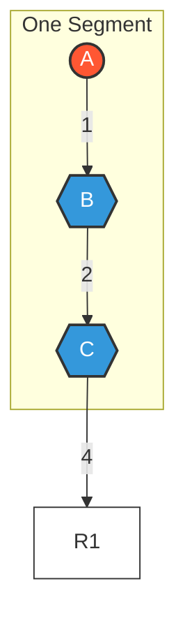
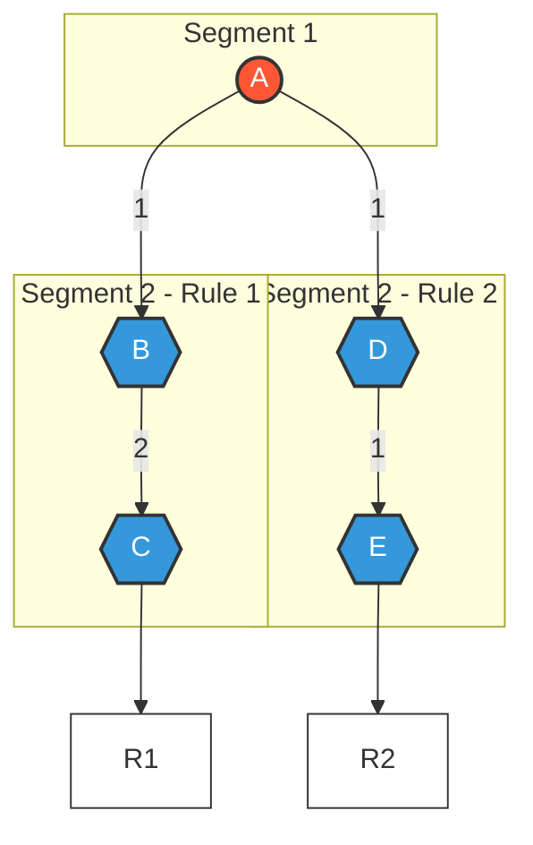

## What is Phreak and Why Should I Care?

If you're working with Drools, you've probably heard terms like "rule engine" and "pattern matching." At the heart of how Drools evaluates your rules is an algorithm called **Phreak**.

Think of Phreak as the "brain" that decides:
- Which rules should run
- When they should run
- How efficiently they run

Understanding the basics of Phreak will help you write better rules and troubleshoot performance issues, even if you don't need to understand all the technical details.

## Phreak vs. Rete: The Simple Version

Drools used to use an algorithm called Rete (pronounced "REE-tee"), but now uses a more modern algorithm called Phreak. Here's the key difference:

- **Rete (old)**: Eager and immediate. It checks all rules any time facts change.
- **Phreak (new)**: Lazy and smart. It only evaluates rules when they're likely to fire completely.

This is similar to the difference between:
- Checking if you've received mail every time you hear a noise outside (Rete)
- Only checking for mail when you actually see the mail carrier at your door (Phreak)

## How Phreak Works: The Basics

### Lazy Evaluation (Smart Rule Checking)

When you add or change facts in Drools, Phreak doesn't immediately try to evaluate all rules. Instead:

1. It queues up all the changes
2. It looks at which rules are most likely to fully match
3. It evaluates only those rules that have a good chance of firing

This saves a lot of processing power, especially when you have hundreds of rules.

### Smart Memory Management

Phreak uses a clever three-layer system to keep track of what's happening:


These three layers are:

1. **Node Memory**: Stores information about individual patterns in your rules
2. **Segment Memory**: Groups related nodes together
3. **Rule Memory**: Keeps track of the overall rule status

Think of it like organizing your mail:
- Node Memory = Individual letters
- Segment Memory = Letters sorted by type (bills, personal, etc.)
- Rule Memory = Your entire mail organization system

This system lets Drools efficiently track which parts of which rules are ready to fire.

## How Rules Are Organized in Memory

Rules in Drools don't exist in isolation. They're broken down into parts that can be shared between rules to improve efficiency.

### Example 1: A Simple Rule

Let's look at a simple rule with three conditions (A, B, and C):



Here, we have one rule (R1) with three parts (A, B, and C). In a simple case like this, all three parts are grouped into a single segment.

### Example 2: Shared Conditions Between Rules

Now let's see what happens when we have two rules that share a condition:



In this case:
- Condition A is shared between two rules
- Phreak puts A in its own segment
- Each rule now has two segments (one shared, one unique)

This organization helps Drools be more efficient because when condition A is matched, both rules can potentially benefit.

## How Phreak Decides Which Rules to Evaluate

Phreak uses a clever bit-mask system (think of it as a series of on/off switches) to keep track of which parts of which rules are ready to fire:

1. Each node (condition) gets its own "on/off" switch
2. When all nodes in a segment are "on," the segment switch turns "on"
3. When all segments for a rule are "on," the rule is ready to be evaluated

This is like saying: "I'll only read a letter if it's been properly addressed, stamped, and delivered to my mailbox" - all conditions need to be met.

## What This Means For You as a Developer

Even without understanding all the internal details, there are practical takeaways:

### Writing More Efficient Rules

1. **Group related rules together** in the same package so they can share conditions
2. **Put the most restrictive conditions first** in your rules
3. **Avoid unnecessarily complex rules** - simpler rules can be evaluated more efficiently

### Troubleshooting Performance Issues

If your Drools application is running slowly:

1. **Look for rules that share common conditions** - these can be more efficiently evaluated
2. **Consider rule units** to isolate groups of rules
3. **Use the appropriate data source types** for your needs

### Configuration Options to Improve Performance

Drools provides several configuration options that affect how Phreak operates:

```java
// Enable parallel rule evaluation for better performance on multi-core systems
KieBaseConfiguration config = KieServices.Factory.get().newKieBaseConfiguration();
config.setOption(ParallelExecutionOption.PARALLEL_EVALUATION);
KieBase kieBase = kieContainer.newKieBase(config);
```

## Real-World Example: Order Processing

Let's imagine we have a few rules for processing orders:

1. If an order is over $1000, apply a 10% discount
2. If a customer has gold status, apply a 15% discount
3. If an order includes international shipping, add a $25 fee

With Phreak, when an order is added to the system:

1. The engine doesn't immediately check all rules
2. If the order is $1200 from a regular customer with domestic shipping, only rule #1 is evaluated
3. If a gold customer places an order, both rules #1 and #2 are evaluated (the best discount will apply)

This targeted evaluation makes the system much more efficient.

## Conclusion

The Phreak algorithm is what makes Drools a powerful and efficient rule engine. While you don't need to understand all the internal details to use Drools effectively, knowing the basics helps you:

- Write better, more efficient rules
- Understand how rule sharing and organization affects performance
- Troubleshoot performance issues when they arise

As you become more comfortable with Drools, you can explore more advanced topics like custom accumulate functions and rule unit composition.
