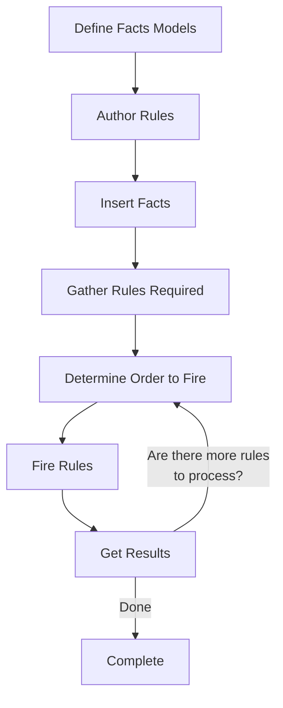

10 min</div>

This guide visually explains how the Drools rule engine processes your business rules and facts. By understanding the underlying mechanisms, you'll be better equipped to write efficient rules.

## The Big Picture: How Drools Works

At a high level, Drools follows this sequence when processing rules:


Let's break down each of these steps and understand what happens behind the scenes.

## 1. Inside the Rule Engine

The Drools rule engine has three key components that interact during rule processing:


The three key components work together:

1. **Production Memory**: Stores your business rules
2. **Working Memory**: Stores your facts (data objects)
3. **Agenda**: Determines which rules to execute and in what order

Here's a simplified view of how these components interact:


## 2. Pattern Matching Process

When facts are inserted into working memory, Drools needs to determine which rules should fire. This process is called pattern matching.

### The Rete Network Evolution: From Rete to Phreak

Drools originally used the Rete algorithm (pronounced "REE-tee" or "RAY-tay") for pattern matching. Since Drools 6, it has been completely replaced by Phreak, an enhanced algorithm that provides:

- **Lazy evaluation**: Rules are only evaluated when needed
- **Set-oriented propagation**: Better performance with large data sets
- **Improved memory usage**: More efficient fact storage
- **Better scalability**: Handles thousands of rules and facts efficiently

While Phreak is architecturally different from Rete, the conceptual model remains similar, making it easier to understand rule execution.

Here's a simplified visualization of how a Rete/Phreak network might look for a rule:


Let's understand each node type:

1. **Object Type Nodes**: Filter facts by their class type
2. **Alpha Nodes**: Apply single-fact constraints (e.g., `age > 18`)
3. **Beta Nodes**: Join multiple facts together (e.g., `$a: Applicant() and $l: Loan(applicant == $a)`)
4. **Terminal Nodes**: Represent rules that are ready to fire

## 3. From Rule Definition to Execution

Let's walk through the lifecycle of a rule from definition to execution using a simple example:

### Rule Definition

```java
rule "Approve loan for good credit"
when
    $application : LoanApplication(approved == false)
    $applicant : Applicant(creditScore > 700)
then
    modify($application) {
        setApproved(true),
        setReason("Good credit score")
    }
    System.out.println("Loan approved");
end
```

### 1. Rule Compilation

When you define rules like the one above, Drools compiles them into a network of nodes:

```
                     ┌─────────────────┐
                     │  Object Type    │
                     │  LoanApplication│
                     └────────┬────────┘
                              │
                              ▼
                     ┌─────────────────┐
                     │  Alpha Node     │
                     │  approved==false│
                     └────────┬────────┘
                              │
                              ▼
           ┌───────────────────────────────┐
           │         Beta Network          │
           │                               │
┌──────────┴─────────┐          ┌──────────┴─────────┐
│   Object Type      │          │    Alpha Node      │
│   Applicant        │─────────▶│    creditScore>700 │
└────────────────────┘          └────────────────────┘
                                         │
                                         ▼
                               ┌─────────────────────┐
                               │   Terminal Node     │
                               │   (Rule Activation) │
                               └─────────────────────┘
```

### 2. Fact Insertion

When you insert facts, they flow through this network:

```java
Applicant john = new Applicant("John", 30, 720);
LoanApplication johnApp = new LoanApplication(john, 50000);

kSession.insert(john);        // Fact 1
kSession.insert(johnApp);     // Fact 2
```

Both facts enter working memory and are processed through the network.

### 3. Pattern Matching and Agenda Creation

As facts flow through the network:

1. The `LoanApplication` fact is checked against its constraints (not approved)
2. The `Applicant` fact is checked against its constraints (credit score > 700)
3. If both match, the rule is activated and placed on the agenda


### 4. Rule Execution

When you call `fireAllRules()`, Drools executes the rules on the agenda:

```java
kSession.fireAllRules();  // Execute activated rules
```

The rule executes its action (the "then" part), which approves the loan application.

### 5. Working Memory Update

After rule execution, working memory is updated:

```
Working Memory (Before)          Working Memory (After)
─────────────────────────        ─────────────────────────
Applicant(creditScore=720)       Applicant(creditScore=720)
LoanApplication(approved=false)  LoanApplication(approved=true)
```

### 6. Re-evaluation (if needed)

Because we used `modify()` to change the loan application, Drools automatically re-evaluates any rules that might be affected by this change.

## 4. The Two-Phase Execution Cycle

When you call `fireAllRules()`, Drools enters a two-phase execution cycle:

```
┌─────────────────────────────┐      ┌─────────────────────────────┐
│                             │      │                             │
│   Agenda Evaluation Phase   │──────▶  Working Memory Actions     │
│                             │      │  Phase                      │
└─────────────┬───────────────┘      └───────────┬─────────────────┘
              │                                  │
              └──────────────────────────────────┘
```

1. **Agenda Evaluation Phase**: The rule engine selects rules that can be executed.
   - If no more rules can be executed, the cycle ends
   - If executable rules are found, they're registered in the agenda

2. **Working Memory Actions Phase**: The rule engine executes the consequences (actions) of activated rules.
   - After all consequences are complete, or if `fireAllRules()` is called again, the process returns to the agenda evaluation phase

## 5. Conflict Resolution

What happens when multiple rules are eligible to fire? Drools uses conflict resolution strategies to determine the execution order:

### Salience (Priority)

Rules with higher salience values fire before rules with lower values:

```java
rule "High Priority Rule"
    salience 100
when
    // conditions
then
    // actions
end

rule "Low Priority Rule"
    salience 10
when
    // conditions
then
    // actions
end
```

In this example, the "High Priority Rule" will fire before the "Low Priority Rule" if both are activated.

### Agenda Groups

Rules can be partitioned into agenda groups, and only rules in the focus group are eligible for execution:


Only rules in the "calculation" group will fire until that group is empty or loses focus.

## 6. Stateful vs. Stateless Sessions Visualized

### Stateful Session

A stateful session maintains facts across multiple `fireAllRules()` calls:

```
 ┌─────────────────────┐
 │   Stateful Session  │
 └──────────┬──────────┘
            │
            ▼
┌───────────────────────┐
│     Working Memory    │
│  ───────────────────  │      ┌─────────────┐
│  Applicant(John)      │◄─────┤ insert(john)│
│                       │      └─────────────┘
└───────────┬───────────┘
            │
            ▼
┌───────────────────────┐
│     Working Memory    │
│  ───────────────────  │      ┌──────────────────┐
│  Applicant(John)      │◄─────┤ insert(johnApp)  │
│  LoanApplication(...) │      └──────────────────┘
└───────────┬───────────┘
            │
            ▼
┌───────────────────────┐
│     Working Memory    │
│  ───────────────────  │      ┌──────────────────┐
│  Applicant(John)      │◄─────┤ fireAllRules()   │
│  LoanApplication(...) │      └──────────────────┘
│ [AFTER RULE EXECUTION]│
└───────────┬───────────┘
            │
            ▼
┌───────────────────────┐
│     Working Memory    │
│  ───────────────────  │      ┌──────────────────┐
│  Applicant(John)      │◄─────┤ insert(mary)     │
│  LoanApplication(...) │      └──────────────────┘
│  Applicant(Mary)      │
└───────────┬───────────┘
            │
            ▼
┌───────────────────────┐
│     Working Memory    │
│  ───────────────────  │      ┌──────────────────┐
│  Applicant(John)      │◄─────┤ dispose()        │
│  LoanApplication(...) │      └──────────────────┘
│  Applicant(Mary)      │
│  [SESSION DESTROYED]  │
└───────────────────────┘
```

### Stateless Session

A stateless session processes all facts in a single operation and doesn't maintain state:

```
┌───────────────────────┐
│   Stateless Session   │
└──────────┬────────────┘
           │
           ▼
┌───────────────────────┐
│  Insert all facts     │    ┌─────────────────────────┐
│  Execute all rules    │◄───┤ execute([john, johnApp])│
│  Dispose automatically│    └─────────────────────────┘
└───────────────────────┘

┌───────────────────────┐
│   Stateless Session   │
└──────────┬────────────┘
           │
           ▼
┌───────────────────────┐
│  Insert all facts     │    ┌─────────────────────────┐
│  Execute all rules    │◄───┤ execute([mary, maryApp])│
│  Dispose automatically│    └─────────────────────────┘
└───────────────────────┘
```

Each `execute()` call is a separate, isolated operation with no shared state between calls.

## 7. Truth Maintenance and Logical Insertions

Drools supports automatic truth maintenance through logical insertions. When you use `insertLogical()` instead of `insert()`, the fact is automatically retracted when the conditions that led to its insertion are no longer true.

```
                   Initial State
┌─────────────────────────────────────────┐
│ Working Memory                          │
│ ───────────────                         │
│ Person(age=16)                          │
└─────────────────┬───────────────────────┘
                  │
                  ▼
┌─────────────────────────────────────────┐
│ Rule "Infer Child" fires                │
│ when                                    │
│   $p : Person(age < 18)                 │
│ then                                    │
│   insertLogical(new IsChild($p))        │
└─────────────────┬───────────────────────┘
                  │
                  ▼
┌─────────────────────────────────────────┐
│ Working Memory                          │
│ ───────────────                         │
│ Person(age=16)                          │
│ IsChild(person=Person(age=16))          │
└─────────────────┬───────────────────────┘
                  │
                  ▼
┌─────────────────────────────────────────┐
│ Update Person age                       │
│ person.setAge(20)                       │
│ update(factHandle, person)              │
└─────────────────┬───────────────────────┘
                  │
                  ▼
┌─────────────────────────────────────────┐
│ Working Memory                          │
│ ───────────────                         │
│ Person(age=20)                          │
│ [IsChild fact automatically retracted]  │
└─────────────────────────────────────────┘
```

## 8. Event Processing in Drools

For time-based events, Drools supports two processing modes:

### Cloud Mode (Default)

All events are treated as regular facts with no temporal constraints:

```
┌───────────────────────────────────────────┐
│ Working Memory (Cloud Mode)               │
│ ───────────────────────────               │
│ StockTick(symbol="AAPL", price=150.00)    │
│ StockTick(symbol="MSFT", price=245.00)    │
│ StockTick(symbol="AAPL", price=152.00)    │
│                                           │
│ [Events processed in insertion order      │
│  regardless of their time stamps]         │
└───────────────────────────────────────────┘
```

### Stream Mode

Events are processed with temporal awareness:

```
┌───────────────────────────────────────────┐
│ Working Memory (Stream Mode)              │
│ ───────────────────────────               │
│ Time: 10:01:00                            │
│ StockTick(symbol="AAPL", price=150.00)    │
│                                           │
│ Time: 10:02:00                            │
│ StockTick(symbol="MSFT", price=245.00)    │
│                                           │
│ Time: 10:03:00                            │
│ StockTick(symbol="AAPL", price=152.00)    │
│                                           │
│ [Events processed in chronological order] │
└───────────────────────────────────────────┘
```

## 9. Sliding Windows

In stream mode, you can define sliding windows of time or length to process only recent events:

### Time Window

```
┌───────────────────────────────────────────┐
│ Sliding Time Window (2 minutes)           │
│ ─────────────────────────────             │
│                                           │
│ Current time: 10:03:00                    │
│                                           │
│ In window:                                │
│ ──────────                                │
│ StockTick(time=10:02:00, symbol="MSFT")   │
│ StockTick(time=10:03:00, symbol="AAPL")   │
│                                           │
│ Outside window (expired):                 │
│ ─────────────────────                     │
│ StockTick(time=10:01:00, symbol="AAPL")   │
└───────────────────────────────────────────┘
```

### Length Window

```
┌───────────────────────────────────────────┐
│ Sliding Length Window (last 2 events)     │
│ ────────────────────────────────          │
│                                           │
│ In window:                                │
│ ──────────                                │
│ StockTick(time=10:02:00, symbol="MSFT")   │
│ StockTick(time=10:03:00, symbol="AAPL")   │
│                                           │
│ Outside window:                           │
│ ───────────────                           │
│ StockTick(time=10:01:00, symbol="AAPL")   │
└───────────────────────────────────────────┘
```

## 10. Temporal Operators

Drools supports temporal operators to define relationships between events:

```
┌─────────────────────────────────────────────────────────────────────┐
│ Temporal Relationship: "after"                                      │
│ ────────────────────────────                                        │
│                                                                     │
│ StockTick(symbol="AAPL", price=150)  │                              │
│                           │          │                              │
│                           │          │                              │
│                           │          ▼                              │
│                           │     StockTick(symbol="AAPL", price=152) │
│                           │                                         │
│                           │                                         │
│             Event B occurs after Event A                            │
└─────────────────────────────────────────────────────────────────────┘
```

Drools supports many temporal operators including:
- `after`/`before`
- `coincides`
- `during`/`includes`
- `finishes`/`finished by`
- `meets`/`met by`
- `overlaps`/`overlapped by`
- `starts`/`started by`

## 11. Property Reactivity

By default, Drools only re-evaluates rules when properties that are actually used in constraints change:

```
┌───────────────────────────────────────────────────┐
│ Rule:                                             │
│ "Approve high value customer"                     │
│ when                                              │
│   Customer(status == "Gold", spending > 1000)     │
│ then                                              │
│   // Actions                                      │
└────────────────────┬──────────────────────────────┘
                     │
                     ▼
┌───────────────────────────────────────────────────┐
│ Working Memory                                    │
│ ─────────────                                     │
│ Customer(                                         │
│   name="John",                                    │
│   age=35,           ← Changing this property      │
│   status="Gold",    ← Reactive property           │
│   spending=1200     ← Reactive property           │
│ )                                                 │
└───────────────────────────────────────────────────┘
```

When you change the `age` property, the rule isn't re-evaluated because the rule doesn't use it.
When you change `status` or `spending`, the rule is re-evaluated.


This gives you visibility into when:
- Facts are inserted, updated, or deleted
- Rules are activated or fired
- Agenda groups are pushed or popped

### Logging

Configure SLF4J logging to see detailed information:

```xml
<logger name="org.drools" level="debug"/>
```

This creates a log file that can be opened with the Audit View tool.

## 13. Life Cycle of a Drools Application

Here's the typical lifecycle of a Drools application:



## Summary

You've now seen how the Drools rule engine processes rules and facts. Understanding these internal mechanisms will help you:

1. **Write more efficient rules**: By understanding how the pattern matching works, you can structure your rules for better performance
2. **Troubleshoot issues**: When rules don't fire as expected, you know where to look
3. **Choose the right session type**: Based on your use case, you can select stateful or stateless sessions
4. **Work with events**: You can process time-based events using stream mode and sliding windows

The visual representations in this guide are simplified, but they provide a mental model of how Drools works under the hood. As you become more familiar with Drools, you'll develop an intuition for how changes to your rules and facts affect rule execution.

Remember that Drools is designed to separate business logic from application code. This separation makes your systems more maintainable and adaptable to changing requirements.
