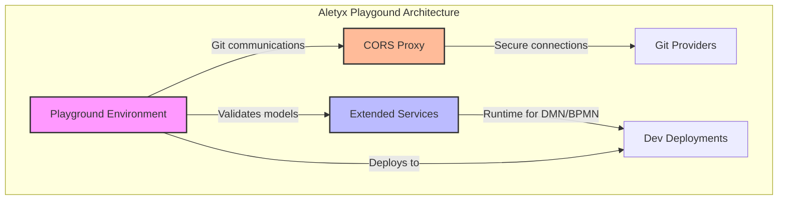

## Introduction

Aletyx Playground is built on a modular architecture that enables a powerful, browser-based development experience. This document details the key components that make up the Aletyx Playground platform, how they interact, and how they can be customized to meet your organization's needs.

## Core Components

Aletyx Playground consists of three primary components that work together to provide a comprehensive development environment:



### 1. Studio Environment

The Studio Environment is the primary user interface component of Aletyx Playground that users interact with directly in their browser.

#### Key Features

- **Web-based Editors**: Sophisticated editors for DMN and BPMN with real-time validation
- **Project Management**: Facilities for creating, importing, and organizing projects
- **Git Integration**: Interface for synchronizing with remote Git repositories
- **Deployment Tools**: Controls for deploying models to development environments
- **In-browser Storage**: Local storage of projects and preferences within the browser

#### Technical Details

- Implemented as a modern web application that runs entirely in the browser
- Stores all project data and preferences in browser local storage
- Communicates with Extended Services for validation and execution
- Connects to Git providers through the CORS Proxy
- Can be customized with organization-specific branding and accelerators

### 2. CORS Proxy Service

The CORS Proxy Service enables secure communication between the browser-based Studio Environment and external Git providers, overcoming cross-origin restrictions that would otherwise prevent direct communication. This is because Git providers such as GitHub and BitBucket do not typically allow web page access into their systems and this is the means to use a proxy to handle the desired communication to push/pull/etc with Git. This can also be true for utilizing Dev Deployments as well since some OpenShift distributions or local Kubernetes environments (the only supported Kubernetes Dev Deploy in 10.1.0-aletyx) to handle the deployment.

#### Key Features

- **Secure Git Communication**: Proxies requests to Git providers (GitHub, BitBucket, etc.)
- **Authentication Handling**: Manages tokens and authentication with Git providers
- **Cross-Origin Support**: Solves CORS (Cross-Origin Resource Sharing) restrictions
- **Request Filtering**: Only allows approved operations and endpoints
- **Development Deployment Support**: Facilitates deployment to Kubernetes/OpenShift

#### Technical Details

- Lightweight service that runs in its own container
- Default port is 7081 in standard deployments
- Can be configured via the `KIE_SANDBOX_CORS_PROXY_URL` environment variable
- Essential for enabling Git operations (clone, pull, push) from the browser

#### Configuration Options

```yaml
# Example configuration for CORS Proxy in a Docker Compose file
cors-proxy:
  image: quay.io/aletyx/cors:latest
  ports:
    - "7081:7081"
  environment:
	- CORS_PROXY_ORIGIN=*
	- CORS_PROXY_VERBOSE=false
```

**CORS_PROXY_ORIGIN**: Sets the value of the 'Access-Control-Allow-Origin' header, defaults to `*` to allow all origins
**CORS_PROXY_VERBOSE**: Allows the proxy to run in verbose mode for more logging, which can be useful to trace requests on development environments. Defaults to `false`

### 3. Extended Services

The Extended Services component provides runtime validation, execution, and deployment capabilities that extend beyond what can be performed directly in the browser.

#### Key Features

- **DMN Validation**: Advanced validation of DMN models against the specification
- **BPMN Validation**: Validation of BPMN models for correctness and best practices
- **Runtime Execution**: Ability to execute DMN models for testing
- **Model Transformation**: Processes models for execution in target environments

#### Technical Details

- Quarkus Java-based service running in its own container
- Default port is 21345 in standard deployments from `docker compose`
- Can be configured via the `KIE_SANDBOX_EXTENDED_SERVICES_URL` environment variable
- Uses the KIE API to validate and execute models
- Provides runtime feedback to the Studio Environment

#### Configuration Options

```yaml
# Example configuration for Extended Services in a Docker Compose file
extended-services:
  image: quay.io/aletyx/extended-services:latest
  ports:
    - "21345:21345"
  environment:
    - LOG_LEVEL=info
```

## Aletyx Playground - The Lightweight, but Powerful Way to Work With Your Intelligent Process Orchestrations Projects

Aletyx Playground provides a light weight environment that does not require extra installations on your workstation to get working with BPMN and DMN models right away. By being a distributed-browser based environment, you have a near limitless scalability of how many unique editors to DMN and BPMN files to build your Intelligent Process Orchestrations. There are several important features of Aletyx Playground that we will cover in this section including:

- [DMN Modeler](#dmn-modeler)
- [DMN Runner](#dmn-runner)
- [BPMN Modeler](#bpmn-modeler)
- [Working with Git Providers](#working-with-git-providers)
- [Dev Deployments](#dev-deployments)

### DMN Modeler

### DMN Runner

### BPMN Modeler

### Working with Git Providers

### Dev Deployment Service

While not a core component of Aletyx Playground itself, the Dev Deployment Service is a critical part of the development workflow that enables testing of models in a runtime environment.

#### Key Features

- **Upload Service**: Receives and processes project files from Aletyx Playground
- **Deployment Management**: Creates and manages deployments in Kubernetes/OpenShift
- **Runtime Environment**: Provides execution environment for DMN and BPMN models
- **Testing Interface**: Exposes APIs and web interfaces for testing models

#### Technical Details

- Runs within deployed containers in Kubernetes/OpenShift
- Extracts files to configured locations
- Triggers application startup after extraction
- Provides health check endpoints for status monitoring
- Provides a Development-only deployment of a DMN service
- Deploys unique services with each deployment (e.g. can run two different versions of the same decision at different endpoints)

#### Configuration Options

The Dev Deployment service can be configured through environment variables:

| Environment Variable                            | Required | Description                                      | Default Value                |
| ----------------------------------------------- | -------- | ------------------------------------------------ | ---------------------------- |
| `DEV_DEPLOYMENT__UPLOAD_SERVICE_EXTRACT_TO_DIR` | Yes      | Directory where uploaded files will be extracted | *empty*                      |
| `DEV_DEPLOYMENT__UPLOAD_SERVICE_PORT`           | Yes      | Port for the HTTP server                         | *empty* (8080 on base image) |
| `DEV_DEPLOYMENT__UPLOAD_SERVICE_API_KEY`        | Yes      | API key for upload authentication                | *empty*                      |
| `DEV_DEPLOYMENT__UPLOAD_SERVICE_ROOT_PATH`      | No       | Subpath for API endpoints                        | `/`                          |

## Deployment Considerations

When deploying Aletyx Playground in your environment, consider:

1. **Network Configuration**: Ensure proper network connectivity between components
2. **Resource Requirements**: Allocate appropriate CPU and memory resources
3. **Storage Requirements**: Provide sufficient storage for container images
4. **Security Considerations**: Configure authentication and secure connections
5. **High Availability**: Consider redundancy for production environments

## Conclusion

The modular architecture of Aletyx Playground provides a flexible, powerful environment for developing business automation solutions. By understanding the roles and capabilities of each component, organizations can effectively deploy, customize, and maintain their Aletyx Playground installations.
