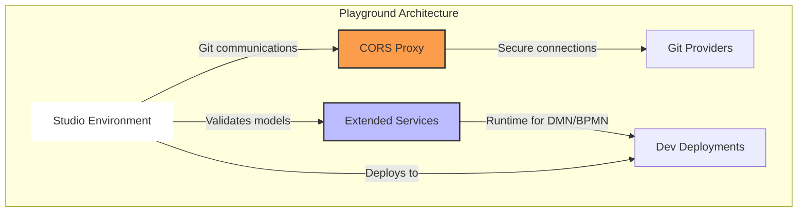

Aletyx Playground is a powerful, browser-based collaboration platform that enables decision engineers and analysts to design, test, and deploy business automation solutions using industry-standard notations like DMN and BPMN. Built on the Apache KIE Sandbox foundation, Aletyx Playground provides an enterprise-ready experience with additional accelerators and deployment capabilities that streamline the journey from modeling to production. When you use https://playground.aletyx.ai, you're using a customized and hosted version of Aletyx Playground.

## What is Aletyx Playground?

Aletyx Playground is an enterprise-grade, cloud-native tool that allows users to:

- Create and edit Decision Models (DMN) and Business Processes (BPMN)
- Test models directly in the browser with real-time validation
- Deploy ephemeral models to development environments with a single click
- Collaborate with team members through Git integration
- Transform models into complete deployable services using accelerators

Unlike traditional development tools, Aletyx Playground operates entirely in your browser while maintaining state locally, ensuring your work is saved even if you close your browser. The platform connects directly to Git providers for version control and to cloud platforms for development deployments.

## Accessing Aletyx Playground or Building Your Own Aletyx Playground

**Cloud Option:**
- Navigate to [https://playground.aletyx.ai](https://playground.aletyx.ai)
- No installation required, start modeling immediately

**Local Docker Option:**

```bash
curl -sL https://raw.githubusercontent.com/aletyx-labs/kie-10.0.0-sandbox/refs/heads/main/docker-compose.yaml | docker compose -f - up
```

Then access your version of Aletyx Playground at http://localhost:9090

## Core Architecture

Aletyx Playground consists of three main components that work together to provide a seamless experience:



1. **Studio Environment**: The core modeling interface where you create and edit DMN and BPMN models
2. **Extended Services**: Provides validation and runtime capabilities for testing your models
3. **CORS Proxy**: Facilitates secure communication with Git providers and cloud platforms

This architecture enables a seamless workflow from design to deployment while maintaining security and performance.

## Key Features

### Intelligent Modeling Tools

Aletyx Playground includes advanced editors for DMN (Decision Model and Notation) and BPMN (Business Process Model and Notation) that provide:

- Real-time validation to catch errors early
- Intuitive user interfaces for both technical and non-technical users
- Support for the latest standards and specifications
- Testing capabilities built directly into the editors

### Git Integration

Aletyx Playground seamlessly integrates with popular Git providers:

- GitHub and GitHub Enterprise
- BitBucket Cloud
- GitLab (coming soon)

All work is automatically saved locally, with easy synchronization to remote repositories when you're ready to share.

### Dev Deployments

One of the most powerful features of Aletyx Playground is the ability to deploy your models directly to development environments:

- One-click development deployment to a local Kubernetes or OpenShift
- Automatic generation of containerized applications
- Built-in testing interfaces for deployed applications
- Support for custom deployment images
- Ephemeral in nature and can be viewed as temporary services

### Accelerators

Accelerators transform your models into complete, deployable applications:

- Convert DMN/BPMN models into Quarkus microservices
- Add CI/CD pipelines and deployment configurations
- Include testing frameworks and documentation
- Apply organizational standards and best practices

Aletyx provides enhanced accelerators beyond what's available in the community version, including enterprise-focused deployment pipelines and security configurations.

## Workflow Integration

Aletyx Playground is designed to fit seamlessly into modern development workflows:

1. **Model**: Create decisions and processes using standards-based visual editors
2. **Test**: Validate your models directly in the browser
3. **Accelerate**: Transform models into complete applications
4. **Deploy**: Push to development environments with a single click
5. **Refine**: Iterate based on feedback and testing
6. **Commit**: Save changes to version control
7. **Collaborate**: Work with team members on shared models

## Getting Started

The best way to get familiar with Aletyx Playground is to:

1. **Explore the Sample Models**: Try the sample Decision and Process models to understand the core capabilities
2. **Create Your First Model**: Start with a simple decision or process model
3. **Connect to Git**: Set up version control for your projects
4. **Apply an Accelerator**: Transform your model into a deployable application
5. **Deploy to Development**: Test your model in a runtime environment

For more detailed guidance, explore our [Getting Started with Decisions (DMN)](/get-started/playground-dmn) and [Getting Started with Processes (BPMN)](/get-started/playground-bpmn) guides.

## Next Steps

Ready to dive deeper? Explore these resources:

- [Components of Aletyx Playground](/platform/playground/components)
- [Detailed DMN Modeling Guide](/guides/dmn/intro)
- [BPMN Process Modeling](/guides/process/bpmn-examples)
- [Working with Accelerators](/platform/playground/accelerators)
- [Development Deployments](/platform/playground/dev-deployments)
- [Connecting to Git Providers](/get-started/git)

Aletyx Playground provides the foundation for creating powerful, cloud-native business automation solutions that bridge the gap between business experts and technical teams.
