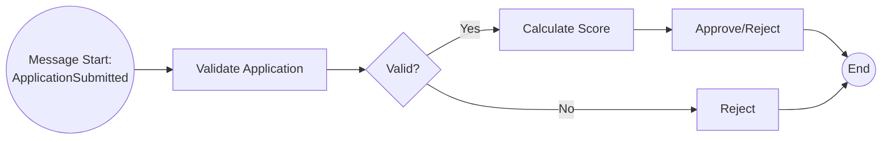
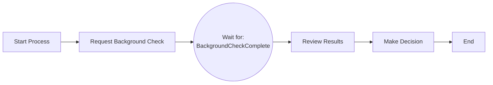
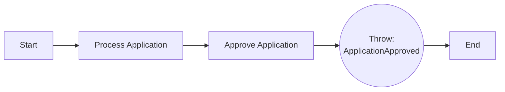

Event-driven architecture (EDA) enables loosely coupled, scalable, and resilient systems by allowing components to communicate through asynchronous events rather than direct calls. Aletyx Enterprise Build of Kogito and Drools provides native support for event-driven patterns through Kogito's integration with Apache Kafka and CloudEvents, enabling rules, decisions, and processes to consume and produce events seamlessly.

## Why Event-Driven Architecture?

Event-driven architecture offers compelling advantages for modern business automation:

- **Loose coupling:** Services interact without direct dependencies
- **Scalability:** Components scale independently based on load
- **Resilience:** System continues functioning even if individual services fail
- **Real-time responsiveness:** React to business events as they occur
- **Audit trail:** Events provide natural history of system activity
- **Integration flexibility:** Add new consumers without modifying producers

## Kogito's Native Kafka Integration

Kogito running on Quarkus provides **out-of-the-box Kafka integration** with minimal configuration. By default, Kogito services:

- **Consume CloudEvents** from Kafka topics automatically
- **Produce CloudEvents** to Kafka topics as output
- **Route events** to the correct engine based on CloudEvents metadata
- **Handle serialization** for common data formats (JSON, Avro)
- **Support backpressure** and reactive streaming patterns

### CloudEvents Standard

Kogito adopts the **CloudEvents** specification for event metadata, ensuring consistent event routing across services:

```json
{
  "specversion": "1.0",
  "type": "ApplicationSubmitted",
  "source": "loan-application-ui",
  "id": "A001-20250131-143052",
  "time": "2025-01-31T14:30:52Z",
  "datacontenttype": "application/json",
  "data": {
    "applicantId": "A001",
    "income": 85000,
    "requestedAmount": 250000,
    "term": 30
  }
}
```

**Key CloudEvents attributes:**

- **type:** Identifies event category (e.g., "RulesRequest", "DecisionRequest")
- **source:** Origin system or service
- **id:** Unique identifier for event instance
- **datacontenttype:** Format of event payload
- **data:** Business payload

## Event-Driven Rules with Drools

Drools in Kogito can continuously listen to Kafka topics and evaluate rules as events arrive.

### Rules Request Pattern

Rules expect events with `type="RulesRequest"` containing facts to insert into the rule session.

**Example Drools Rule Unit:**

```java
package org.example.fraud;

public class FraudDetectionUnit implements RuleUnitData {
    private final DataStore<Transaction> transactions;
    private final DataStore<FraudAlert> alerts;

    public FraudDetectionUnit() {
        this.transactions = DataSource.createStore();
        this.alerts = DataSource.createStore();
    }

    public DataStore<Transaction> getTransactions() {
        return transactions;
    }

    public DataStore<FraudAlert> getAlerts() {
        return alerts;
    }
}
```

**Rules file (fraud-detection.drl):**

```drl
package org.example.fraud;
unit FraudDetectionUnit;

rule "Large Transaction Alert"
when
    $t: /transactions[amount > 10000]
then
    alerts.add(new FraudAlert($t.getId(), "LARGE_AMOUNT"));
end

rule "Rapid Succession Alert"
when
    $t1: /transactions
    $t2: /transactions[
        this != $t1,
        accountId == $t1.accountId,
        timestamp - $t1.timestamp < 300000 // 5 minutes
    ]
then
    alerts.add(new FraudAlert($t1.getId(), "RAPID_SUCCESSION"));
end
```

**Kafka configuration (application.properties):**

```properties
# Incoming transactions
mp.messaging.incoming.transactions.connector=smallrye-kafka
mp.messaging.incoming.transactions.topic=transactions
mp.messaging.incoming.transactions.value.deserializer=org.apache.kafka.common.serialization.StringDeserializer

# Outgoing fraud alerts
mp.messaging.outgoing.fraud-alerts.connector=smallrye-kafka
mp.messaging.outgoing.fraud-alerts.topic=fraud-alerts
mp.messaging.outgoing.fraud-alerts.value.serializer=org.apache.kafka.common.serialization.StringSerializer
```

**Event flow diagram:**


### Consuming Rule Events

To consume events for rules evaluation:

1. Configure incoming Kafka channel in `application.properties`
2. Map channel to Rule Unit data source
3. Rules fire automatically as events arrive
4. Results publish to outgoing Kafka channel

## Event-Driven Decisions with DMN

DMN decision services can consume decision requests from Kafka and publish results back.

### Decision Request Pattern

DMN expects events with `type="DecisionRequest"` plus namespace and model name metadata.

**CloudEvents for DMN:**

```json
{
  "specversion": "1.0",
  "type": "DecisionRequest",
  "source": "loan-origination-service",
  "id": "DMN-20250131-001",
  "kogitodmnmodelnamespace": "https://example.com/dmn/credit",
  "kogitodmnmodelname": "CreditScoring",
  "data": {
    "applicant": {
      "age": 35,
      "income": 85000,
      "employmentYears": 8
    },
    "loan": {
      "amount": 250000,
      "term": 30
    }
  }
}
```

**DMN model (credit-scoring.dmn):**

```xml
<dmn:definitions xmlns:dmn="https://www.omg.org/spec/DMN/20230324/MODEL/"
                 namespace="https://example.com/dmn/credit"
                 name="CreditScoring">
  <dmn:decision id="creditScore" name="Credit Score">
    <dmn:decisionTable>
      <dmn:input id="income">
        <dmn:inputExpression typeRef="number">
          <dmn:text>applicant.income</dmn:text>
        </dmn:inputExpression>
      </dmn:input>
      <dmn:output id="score"/>
      <dmn:rule>
        <dmn:inputEntry>
          <dmn:text>&gt; 100000</dmn:text>
        </dmn:inputEntry>
        <dmn:outputEntry>
          <dmn:text>750</dmn:text>
        </dmn:outputEntry>
      </dmn:rule>
    </dmn:decisionTable>
  </dmn:decision>
</dmn:definitions>
```

**Kafka configuration:**

```properties
# Incoming decision requests
mp.messaging.incoming.dmn-requests.connector=smallrye-kafka
mp.messaging.incoming.dmn-requests.topic=decision-requests
mp.messaging.incoming.dmn-requests.value.deserializer=org.apache.kafka.common.serialization.StringDeserializer

# Outgoing decision responses
mp.messaging.outgoing.dmn-responses.connector=smallrye-kafka
mp.messaging.outgoing.dmn-responses.topic=decision-responses
mp.messaging.outgoing.dmn-responses.value.serializer=org.apache.kafka.common.serialization.StringSerializer
```

**Decision event flow:**


## Event-Driven Processes with jBPM

Kogito's jBPM-based process engine provides sophisticated event-driven capabilities for process orchestration.

### Message Start Events

Processes can start automatically when specific events arrive.

**BPMN process with message start:**



**Process definition (loan-approval.bpmn):**

The message start event listens for events with `type="ApplicationSubmitted"` from Kafka.

**Kafka configuration:**

```properties
# Incoming application events start the process
mp.messaging.incoming.loan-applications.connector=smallrye-kafka
mp.messaging.incoming.loan-applications.topic=loan-applications
mp.messaging.incoming.loan-applications.value.deserializer=org.apache.kafka.common.serialization.StringDeserializer
```

**Triggering event:**

```json
{
  "specversion": "1.0",
  "type": "ApplicationSubmitted",
  "source": "loan-portal",
  "id": "APP-001",
  "data": {
    "applicationId": "APP-001",
    "applicant": {
      "name": "Jane Smith",
      "income": 95000
    },
    "loanAmount": 300000
  }
}
```

### Intermediate Catch Events

Processes can pause and wait for specific events before continuing.

**BPMN with intermediate catch event:**



**Event correlation:**

The intermediate catch event matches incoming events based on correlation keys (e.g., `applicationId`).

**Kafka event:**

```json
{
  "specversion": "1.0",
  "type": "BackgroundCheckComplete",
  "source": "background-check-service",
  "id": "BGC-123",
  "data": {
    "applicationId": "APP-001",
    "status": "APPROVED",
    "score": 85
  }
}
```

**Process continues automatically** when the matching event arrives on the configured Kafka topic.

### Throwing Intermediate Events

Processes can publish events to trigger actions in other services.

**BPMN with intermediate throw event:**



**Published event:**

```json
{
  "specversion": "1.0",
  "type": "ApplicationApproved",
  "source": "loan-approval-process",
  "id": "APPROVED-001",
  "processInstanceId": "PI-12345",
  "data": {
    "applicationId": "APP-001",
    "approvedAmount": 280000,
    "interestRate": 3.5
  }
}
```

**Kafka configuration:**

```properties
# Outgoing process events
mp.messaging.outgoing.process-events.connector=smallrye-kafka
mp.messaging.outgoing.process-events.topic=loan-process-events
mp.messaging.outgoing.process-events.value.serializer=org.apache.kafka.common.serialization.StringSerializer
```

### Complex Event Choreography

Combine multiple event patterns for sophisticated orchestrations.

**Multi-service choreography:**


## Event Integration Patterns

### Request-Response Pattern

Synchronous-style interaction using event pairs.

**Implementation:**

1. Requester publishes request event with correlation ID
2. Responder consumes request, processes, publishes response
3. Requester correlates response using correlation ID

**Example request:**

```json
{
  "type": "CreditScoreRequest",
  "source": "loan-service",
  "id": "REQ-001",
  "correlationId": "CORR-12345",
  "data": {"applicantId": "A001"}
}
```

**Example response:**

```json
{
  "type": "CreditScoreResponse",
  "source": "credit-service",
  "id": "RESP-001",
  "correlationId": "CORR-12345",
  "data": {"score": 720}
}
```

### Event Notification Pattern

One-way notifications with no expected response.

**Use cases:**

- Status updates
- Audit logs
- Monitoring events
- Business metrics

**Example notification:**

```json
{
  "type": "LoanApproved",
  "source": "loan-approval-service",
  "id": "NOTIF-001",
  "data": {
    "loanId": "L-5678",
    "amount": 250000,
    "approvedBy": "system",
    "timestamp": "2025-01-31T15:45:00Z"
  }
}
```

### Event Sourcing Pattern

Store all state changes as immutable events.

**Benefits:**

- Complete audit trail
- Time-travel debugging
- Replay capability
- Event-driven projections

**Implementation:**

1. All state changes publish domain events
2. Events persist in Kafka topic (with retention)
3. Services rebuild state by replaying events
4. Read models project from event stream

### Saga Pattern

Coordinate distributed transactions across services.

**Choreography-based saga:**


**Implementation with Kogito:**

- Each service publishes success/failure events
- Processes react to events and trigger compensating actions
- Kafka ensures reliable event delivery
- Process state tracks saga progress

## Configuration and Deployment

### Quarkus Kafka Configuration

**Basic Kafka setup (application.properties):**

```properties
# Kafka broker connection
kafka.bootstrap.servers=localhost:9092

# Consumer group
kafka.group.id=loan-processing-group

# Auto-offset reset
kafka.auto.offset.reset=earliest

# CloudEvents configuration
mp.messaging.incoming.events.connector=smallrye-kafka
mp.messaging.incoming.events.topic=business-events
mp.messaging.incoming.events.value.deserializer=org.apache.kafka.common.serialization.StringDeserializer
mp.messaging.incoming.events.cloud-events=true

mp.messaging.outgoing.responses.connector=smallrye-kafka
mp.messaging.outgoing.responses.topic=business-responses
mp.messaging.outgoing.responses.value.serializer=org.apache.kafka.common.serialization.StringSerializer
mp.messaging.outgoing.responses.cloud-events=true
```

### Spring Boot Kafka Configuration

**Spring Boot setup (application.yml):**

```yaml
spring:
  kafka:
    bootstrap-servers: localhost:9092
    consumer:
      group-id: loan-processing-group
      auto-offset-reset: earliest
      key-deserializer: org.apache.kafka.common.serialization.StringDeserializer
      value-deserializer: org.apache.kafka.common.serialization.StringDeserializer
    producer:
      key-serializer: org.apache.kafka.common.serialization.StringSerializer
      value-serializer: org.apache.kafka.common.serialization.StringSerializer

kogito:
  messaging:
    incoming:
      events:
        topic: business-events
    outgoing:
      responses:
        topic: business-responses
```

### Kubernetes Deployment

**Deployment with Kafka cluster:**

```yaml
apiVersion: apps/v1
kind: Deployment
metadata:
  name: loan-approval-service
spec:
  replicas: 3
  selector:
    matchLabels:
      app: loan-approval
  template:
    metadata:
      labels:
        app: loan-approval
    spec:
      containers:
      - name: loan-approval
        image: aletyx/loan-approval:1.0.0
        env:
        - name: KAFKA_BOOTSTRAP_SERVERS
          value: "kafka-cluster-kafka-bootstrap:9092"
        - name: KAFKA_GROUP_ID
          value: "loan-approval-group"
        ports:
        - containerPort: 8080
```

## Monitoring Event-Driven Systems

### Key Metrics

Track these metrics for event-driven health:

- **Event lag:** Messages waiting in topic
- **Processing rate:** Events consumed per second
- **Error rate:** Failed event processing
- **Processing latency:** Time from event arrival to completion
- **Dead letter queue size:** Unprocessable events

### Prometheus Metrics

```bash
# Event processing rate
rate(kafka_consumer_fetch_manager_records_consumed_total[5m])

# Consumer lag
kafka_consumer_lag{topic="loan-applications"}

# Processing duration
histogram_quantile(0.95,
  rate(event_processing_duration_seconds_bucket[5m])
)
```

### CloudEvents Tracing

Enable distributed tracing with CloudEvents extensions:

```json
{
  "specversion": "1.0",
  "type": "ApplicationSubmitted",
  "source": "loan-portal",
  "id": "APP-001",
  "traceparent": "00-4bf92f3577b34da6a3ce929d0e0e4736-00f067aa0ba902b7-01",
  "tracestate": "rojo=00f067aa0ba902b7",
  "data": {...}
}
```

## Best Practices

### Event Design

1. **Use meaningful event types:** Choose descriptive, domain-specific names
2. **Version events explicitly:** Include schema version in metadata
3. **Keep events immutable:** Never modify published events
4. **Include correlation IDs:** Enable request-response patterns
5. **Add timestamps:** Track event timing for debugging

### Error Handling

1. **Implement retry logic:** Handle transient failures automatically
2. **Use dead letter topics:** Capture unprocessable events
3. **Log event metadata:** Include correlation IDs in logs
4. **Monitor error rates:** Alert on processing failures
5. **Design compensating actions:** Plan for saga rollbacks

### Performance Optimization

1. **Batch processing:** Process multiple events together when possible
2. **Parallel consumption:** Use multiple consumer instances
3. **Optimize serialization:** Use efficient formats (Avro, Protobuf)
4. **Tune Kafka settings:** Adjust batch size, linger time
5. **Use consumer groups:** Distribute load across instances

### Security Considerations

1. **Encrypt sensitive data:** Use encryption for PII in events
2. **Authenticate consumers:** Require credentials for Kafka access
3. **Authorize topics:** Control which services access which topics
4. **Audit event access:** Log who consumes which events
5. **Use TLS connections:** Encrypt data in transit

## Next Steps

- **Learn BPMN Events:** [Intermediate Events](/processes/bpmn/intermediate-events)
- **Explore Processes:** [Advanced BPMN](/processes/advanced/event-driven)
- **Decision Orchestration:** [Decision Process Integration](/processes/integration/decision-process)
- **Service Tasks:** [Service Orchestration](/processes/integration/service-orchestration)
- **Get Support:** [Contact Aletyx](https://aletyx.com/contact/) for architecture guidance
